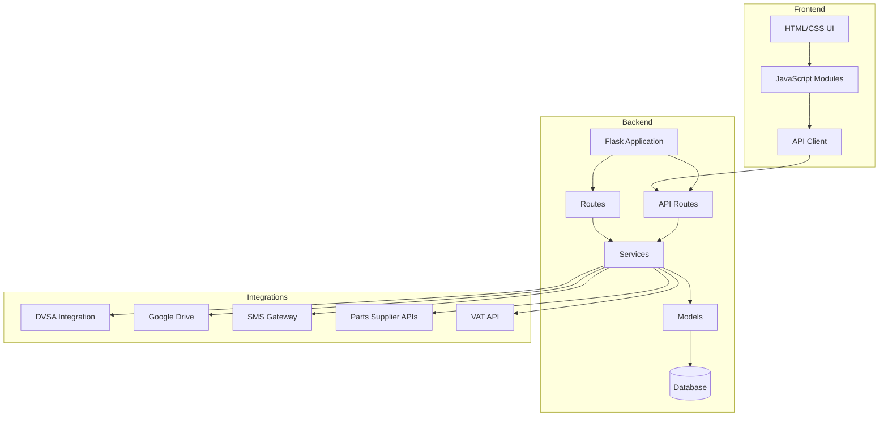
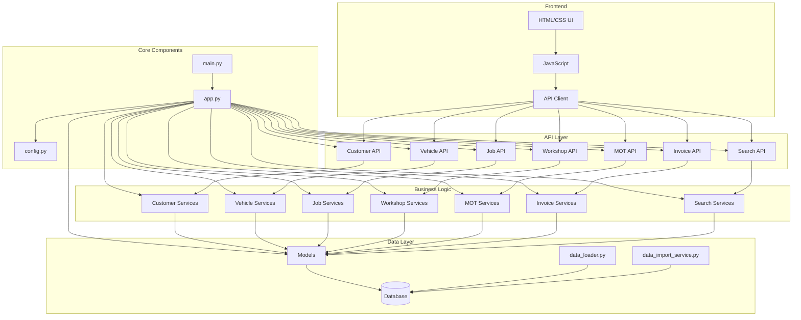
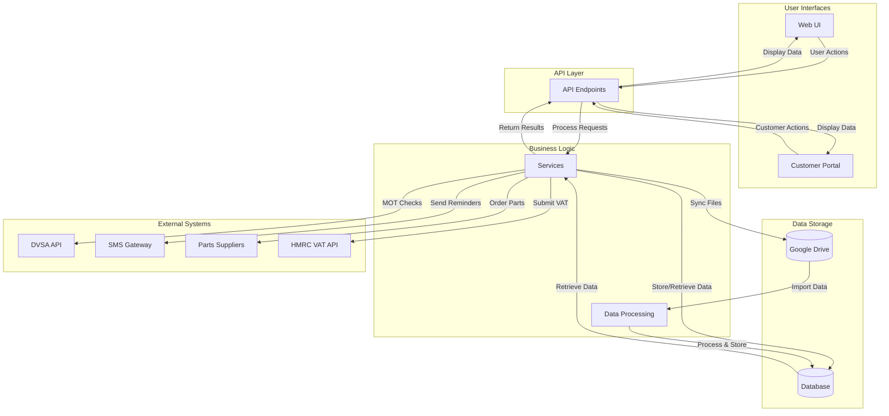
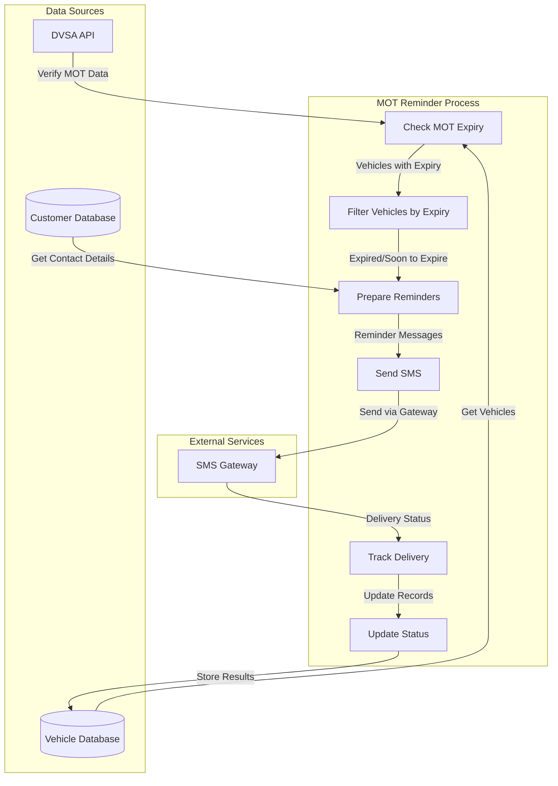
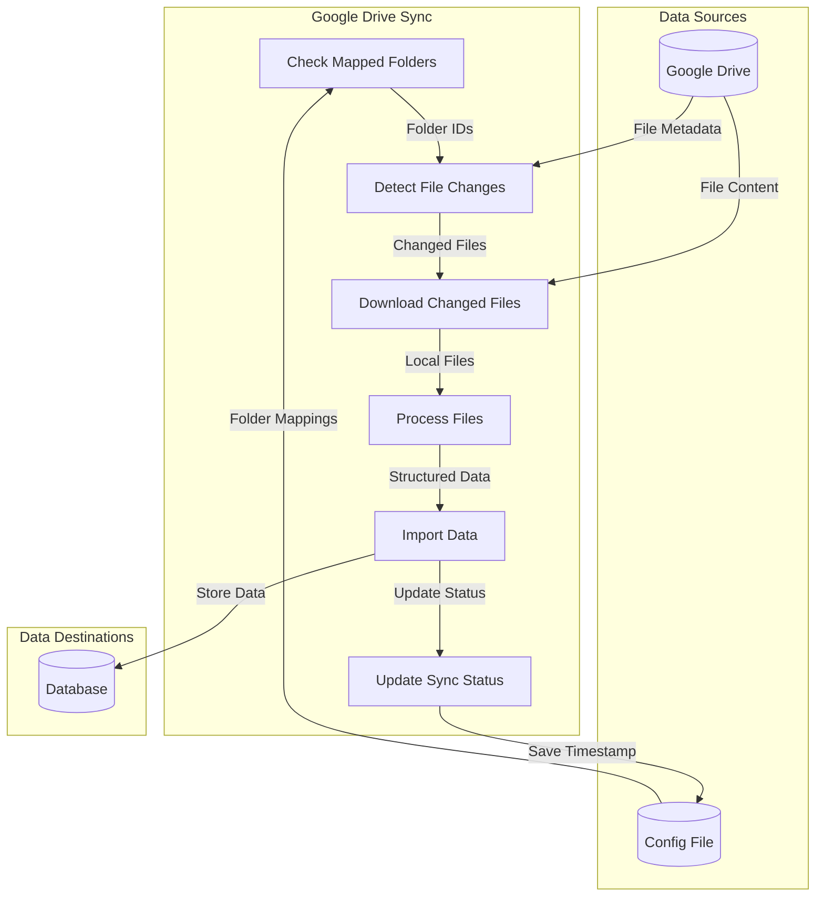
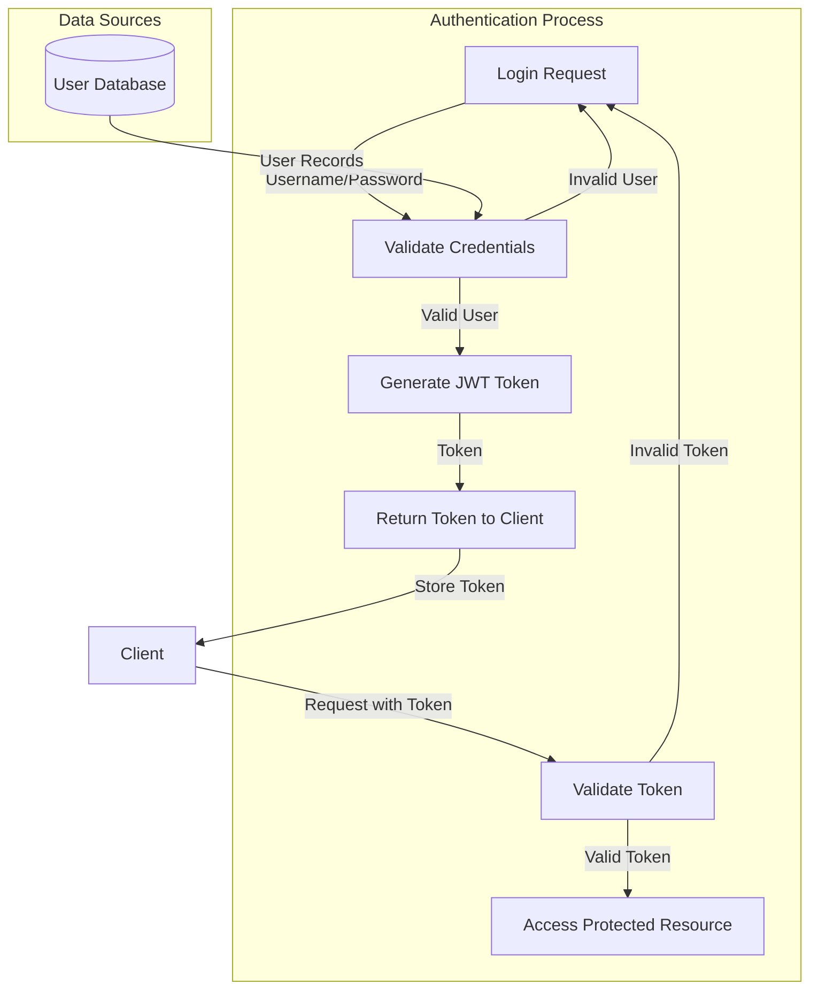

# Garage Management System - System Architecture

## System Architecture Diagram



## Component Relationships



## Data Flow Diagram



## MOT Reminder Service Flow



## Google Drive Integration Flow



## User Authentication Flow



## Job Management Flow

```mermaid
graph TD
    subgraph "Job Lifecycle"
        CreateJob[Create Job]
        AssignTechnician[Assign Technician]
        AllocateBay[Allocate Workshop Bay]
        UpdateStatus[Update Job Status]
        AddParts[Add Parts]
        CompleteJob[Complete Job]
        GenerateInvoice[Generate Invoice]
    end

    subgraph "Data Sources"
        CustomerDB[(Customer Database)]
        VehicleDB[(Vehicle Database)]
        TechnicianDB[(Technician Database)]
        BayDB[(Workshop Bay Database)]
        PartsDB[(Parts Database)]
    end

    CustomerDB -->|Customer Info| CreateJob
    VehicleDB -->|Vehicle Info| CreateJob
    CreateJob -->|New Job| AssignTechnician
    TechnicianDB -->|Available Technicians| AssignTechnician
    AssignTechnician -->|Assigned Job| AllocateBay
    BayDB -->|Available Bays| AllocateBay
    AllocateBay -->|Scheduled Job| UpdateStatus
    UpdateStatus -->|In Progress| AddParts
    PartsDB -->|Parts Inventory| AddParts
    AddParts -->|Parts Added| CompleteJob
    CompleteJob -->|Completed Job| GenerateInvoice
    GenerateInvoice -->|Invoice| CustomerDB
